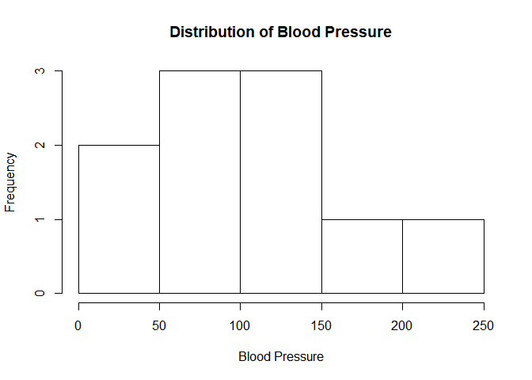
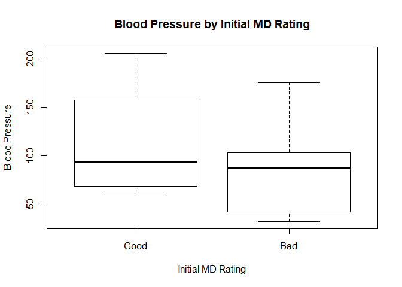
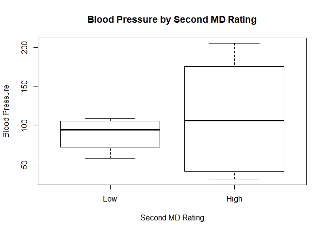
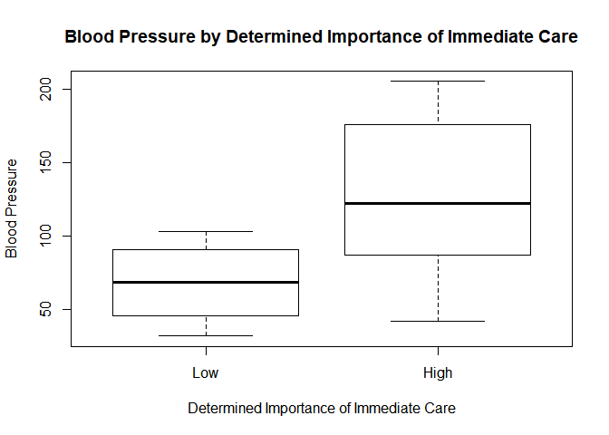

Assignment 4
================
BEW
2025-02-05

``` r
data <- data.frame(
  frequency = c(0.6, 0.3, 0.4, 0.4, 0.2, 0.6, 0.3, 0.4, 0.9, 0.2),
  BP = c(103, 87, 32, 42, 59, 109, 78, 205, 135, 176),
  first_rating = c(1, 1, 1, 1, 0, 0, 0, 0, NA, 1), # 1 = bad, 0 = good
  second_rating = c(0, 0, 1, 1, 0, 0, 1, 1, 1, 1), # 1 = high, 0 = low
  decision = c(0, 1, 0, 1, 0, 1, 0, 1, 1, 1)) # 1 = high priority, 0 = low priority
```

``` r
hist(data$BP, 
     main = "Distribution of Blood Pressure",
     xlab = "Blood Pressure",
     col = "white")
```

<!-- -->

``` r
mean(data$BP)
```

    ## [1] 102.6

``` r
sd(data$BP)
```

    ## [1] 56.14505

``` r
boxplot(BP ~ first_rating, data = data,
        main = "Blood Pressure by Initial MD Rating", 
        xlab = "Initial MD Rating",
        ylab = "Blood Pressure",
        col = "white",
        names = c("Good", "Bad"))
```

<!-- -->

``` r
boxplot(BP ~ second_rating, data = data,
        main = "Blood Pressure by Second MD Rating", 
        xlab = "Second MD Rating",
        ylab = "Blood Pressure",
        col = "white",
        names = c("Low", "High"))
```

<!-- -->

``` r
boxplot(BP ~ decision, data = data,
        main = "Blood Pressure by Determined Importance of Immediate Care", 
        xlab = "Determined Importance of Immediate Care",
        ylab = "Blood Pressure",
        col = "white",
        names = c("Low", "High"))
```

<!-- -->
